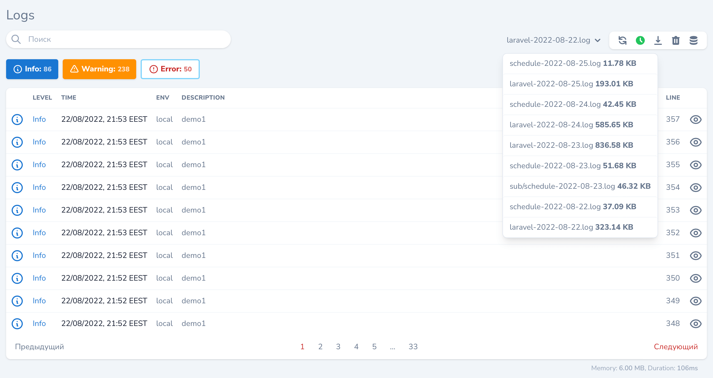
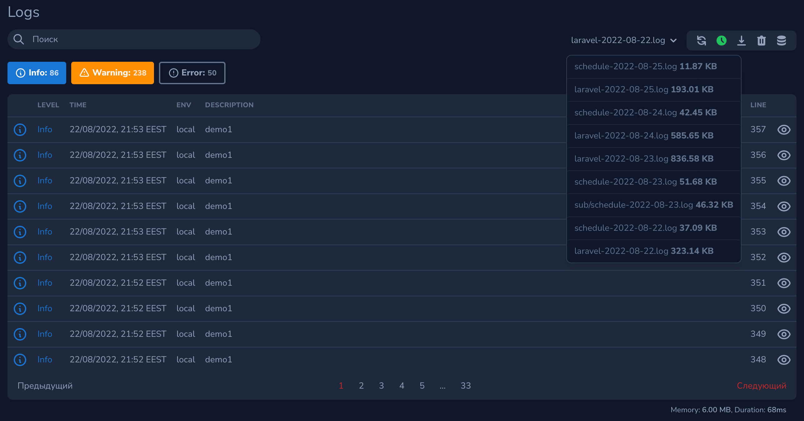

# Nova tool to view logs

[](https://packagist.org/packages/stepanenko3/nova-logs-tool)
[](https://packagist.org/packages/stepanenko3/nova-logs-tool)
[](https://packagist.org/packages/stepanenko3/nova-logs-tool)



## Description

A Laravel Nova tool to manage and keep track of each one of your logs files.

> That repository is an extended version of [KABBOUCHI/nova-logs-tool](https://github.com/KABBOUCHI/nova-logs-tool)

## Features

- Polling
- Refresh button
- Logs from nested directories
- Sticky "view" button
- Dark mode
- Responsive

## Requirements

- `php: >=8.0`
- `laravel/nova: ^4.0`
- 
## Installation

You can install the package in to a Laravel app that uses [Nova](https://nova.laravel.com) via composer:

```bash
composer require stepanenko3/nova-logs-tool
```

Next up, you must register the tool with Nova. This is typically done in the `tools` method of the `NovaServiceProvider`.

```php
// in app/Providers/NovaServiceProvder.php

// ...

public function tools()
{
    return [
        // ...
        new \Stepanenko3\LogsTool\LogsTool(),
    ];
}
```

Publish the package configuration file.

```bash
php artisan vendor:publish --provider="Stepanenko3\LogsTool\LogsToolServiceProvider"
```

## Authorization
```php
// in app/Providers/NovaServiceProvder.php

// ...

public function tools()
{
    return [
        // ...
        // don't return plain `true` value or anyone can see/download/delete the logs, make sure to check if user has permission.
        (new \Stepanenko3\LogsTool\LogsTool())
                ->canSee(function ($request) {
                    return auth()->user()->canSee(); 
                })
                ->canDownload(function ($request) {
                    return  auth()->user()->canDownload();
                })
                ->canDelete(function ($request) {
                    return false;
                }),
    ];
}
```

## Usage

Click on the "nova-logs-tool" menu item in your Nova app to see the tool provided by this package.

Possible environment variables:

``` env
NOVA_LOGS_PER_PAGE=6
NOVA_LOGS_REGEX_FOR_FILES="/^laravel/"
```

## Show latest logs on Dashboard

Create Metric class in app/Nova/Metrics

```php
<?php

namespace App\Nova\Metrics;

use Carbon\Carbon;
use Laravel\Nova\Metrics\MetricTableRow;
use Laravel\Nova\Metrics\Table;
use Stepanenko3\LogsTool\LogsService;

class LatestLogs extends Table
{
    public function __construct(
        protected string $file = 'laravel.log',
        protected int $countLastRow = 3,
    ) {
        //
    }

    public function calculate()
    {
        $lines = array_slice(LogsService::all($this->file), 0, $this->countLastRow);

        foreach ($lines as $line) {
            $rows[] = MetricTableRow::make()
                ->icon($line['level_img'])
                ->iconClass($line['level_class'])
                ->title($line['text'])
                ->subtitle(Carbon::create($line['date'])->diffForHumans());
        }

        return $rows;
    }
}
```

Add Metric declaration code to Cards method of Dashboard class

```php
(new LatestLogs('laravel.log', 5)),
```

### Screenshots




### Changelog

Please see [CHANGELOG](CHANGELOG.md) for more information on what has changed recently.

## Contributing

Please see [CONTRIBUTING](CONTRIBUTING.md) for details.

## Credits

- [Artem Stepanenko](https://github.com/stepanenko3)
- [Georges KABBOUCHI](https://github.com/kabbouchi)

The MIT License (MIT). Please see [License File](LICENSE.md) for more information.
